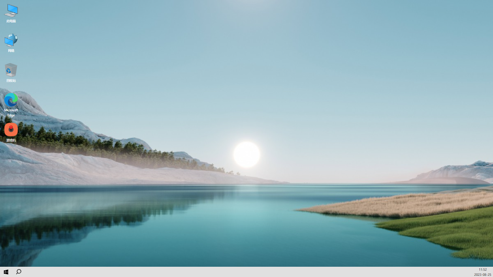
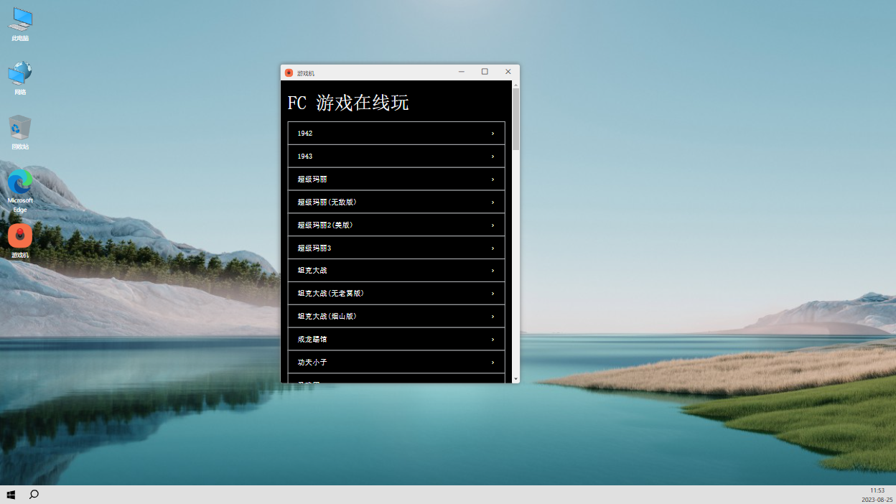
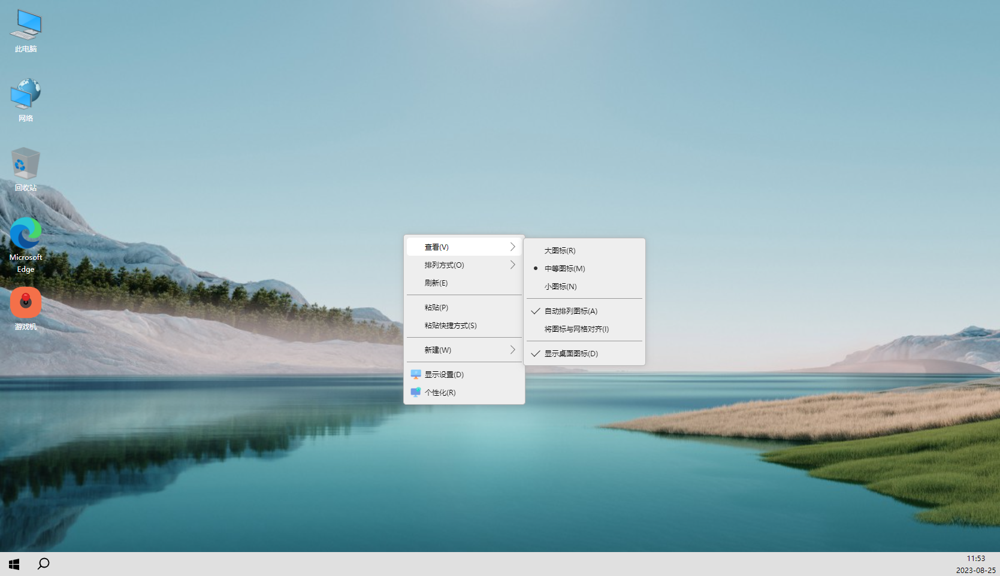

# win10 plus in Vue2

作者    刘先生 :monkey_face:   

这个开源项目旨在使用 Vue2，CSS（LESS）和JS等标准Web技术在Web上复制Windows 10（额外添加一些交互动画）桌面体验。

## 提示

该项目与 Microsoft 没有任何关系，不应与 Microsoft 的操作系统或产品混淆。

## 该项目仍在进行中

项目在线体验地址：[https://www.apestudio.asia/win10plus/](https://www.apestudio.asia/win10plus/)  

## 已实现的功能

* 桌面的右键单击操作
	- [x] 桌面图标的大小调整、显隐控制
	- [x] 刷新
* 任务栏的右键单击操作
	- [x] 此电脑、游戏机
	- [x] 拖动窗口和调整窗口大小
* 双击桌面图标（打开 '应用程序'）
	- [x] 可拖动窗口
	- [x] 可调整窗口的大小
	- [x] 全屏 / 非全屏窗口切换
* 已经完成的 '应用程序'
	- [x] 此电脑
	- [x] 游戏机

## 引用及技术

* 整个项目使用 vue2 开发
* 游戏机的内容来自 [https://lab.ur1.fun/FCGames/#/](https://lab.ur1.fun/FCGames/#/)
* 字体图标使用 [阿里巴巴矢量图标库](https://www.iconfont.cn/)

## 疑问解答

* 这是完整的操作系统吗？
	* 不，这不是一个完整的操作系统，无论如何它也不隶属于Microsoft。
* 花了多长时间？
	* 老实说，好多天！
* 您是否使用过任何 UI / 库？
	* 使用了 lottie 动画库。
* 我可以贡献吗？
	* 是的，你可以创建拉取请求。
